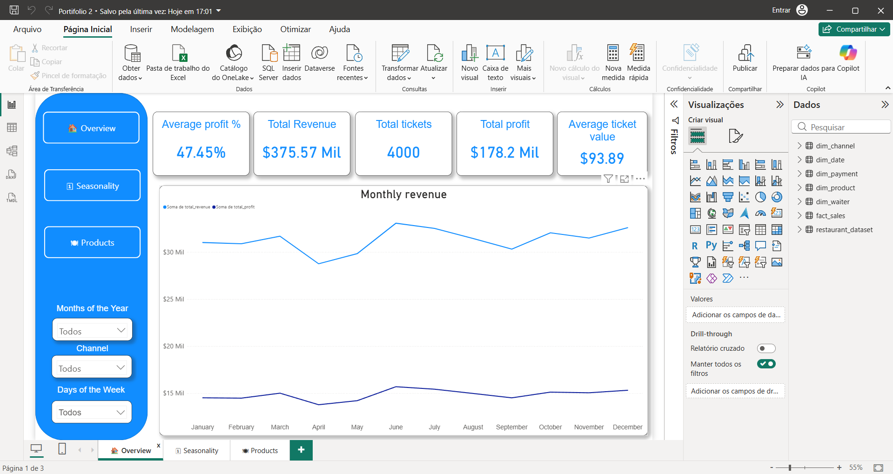

# 📊 Dashboard de Performance de Vendas - Restaurante

## 📌 Sobre o Projeto

Este dashboard foi desenvolvido para monitorar e analisar a performance de vendas de um restaurante (ou serviço de delivery). O objetivo é transformar dados brutos em insights acionáveis, permitindo uma gestão mais estratégica do negócio. Através de uma interface interativa, é possível acompanhar métricas-chave, identificar sazonalidades e descobrir quais produtos geram mais lucro.

## 🚀 Principais Métricas (KPIs)

| Métrica                  | Valor       |
|--------------------------|-------------|
| Receita Total            | $375,57 Mi  |
| Lucro Total              | $178,20 Mi  |
| Total de Tickets         | 4.000       |
| Ticket Médio             | $93,89      |
| Vendas Médias por Dia    | 11          |
| Receita Média por Dia    | $1.026,15   |
| Lucro Médio por Dia      | $486,87     |

## 📈 Insights e Storytelling

### 1️⃣ Evolução Mensal da Receita
O gráfico de barras empilhadas mostra a contribuição de cada produto mês a mês. Observa-se uma variação significativa ao longo do ano, indicando possíveis *sazonalidades* – períodos de alta e baixa demanda. Esses dados são fundamentais para planejar campanhas de marketing e ajustar estoques.

### 2️⃣ Produtos Mais Lucrativos
Analisando a rentabilidade por item, os cinco principais produtos em lucro são:

| Item    | Lucro Total ($) |
|---------|-----------------|
| Steak   | 39.273,56       |
| Sushi   | 27.039,81       |
| Pizza   | 26.204,84       |
| Pasta   | 19.482,88       |
| Salad   | 14.743,53       |

*Conclusão:* Estratégias como *upselling*, combos promocionais e destaque no cardápio para esses itens podem potencializar ainda mais os resultados.

### 3️⃣ Segmentação Avançada
O dashboard permite filtrar os dados por:
- *Mês do Ano*
- *Canal de Vendas*
- *Dia da Semana*

Com isso, é possível responder perguntas como:
- "Qual canal gera mais receita aos sábados?"
- "Como a sazonalidade afeta as vendas de sushi?"
- "Quais dias da semana têm maior ticket médio?"

## 🛠️ Ferramentas Utilizadas

- *Power BI – Criação do dashboard e visualizações.
- *Excel / CSV* – Fonte de dados original.
- *Power Query* – Tratamento e limpeza dos dados.

## Aplicação dos princípios da arquitetura medalhão.

### 🥉 Camada Bronze – Dados Brutos
Nesta etapa:
- Carregamento do dataset original sem alterações estruturais.
- Preservação da granularidade original

### 🥈 Camada Silver – Tratamento e Modelagem
Nesta fase trabalhei:
- Limpeza de duplicidades
- Padronização de tipos de dados
- Criação de colunas derivadas (ex: weekend_day)
- Separação em modelo estrela
- Estruturação do modelo com f_sales (tabela fato), dim_product, dim_date, dim_channel, dim_payment, dim_waiter
Isso garantiu:
- relacionamentos 1:N
- filtros consistentes e performance otimizada
Aqui a preocupação foi qualidade e integridade analítica.

### 🥇 Camada Gold – Camada Analítica
Na camada gold construí:
KPIs estratégicos: 
- Total Revenue
- Total Profit
- Average Ticket
- Profit %
- Total Tickets
Medidas DAX:
- % de contribuição por produto
- top 3 produtos mais lucrativos
- arrecadação média dia
- lucro médio dia
- média de vendas por dia
